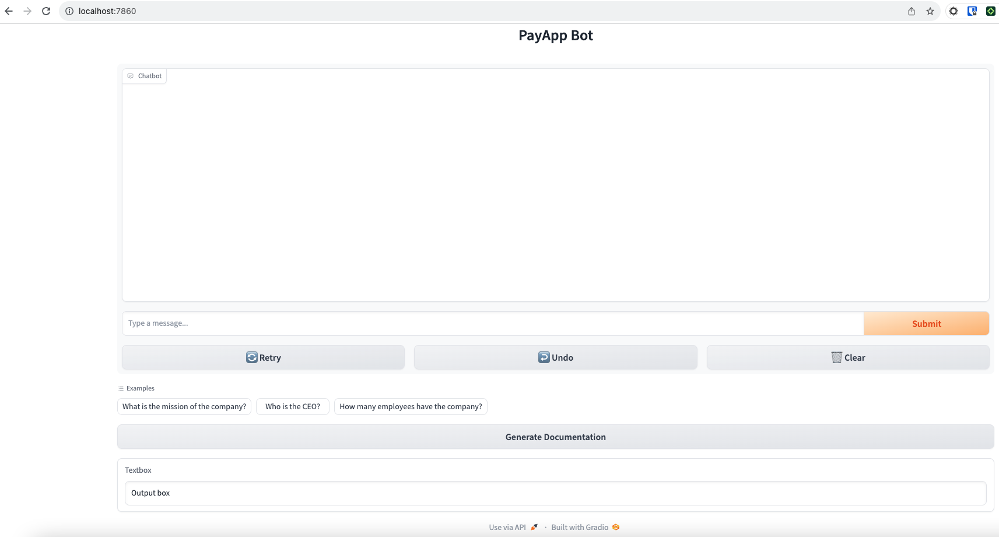
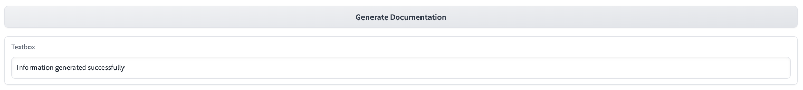
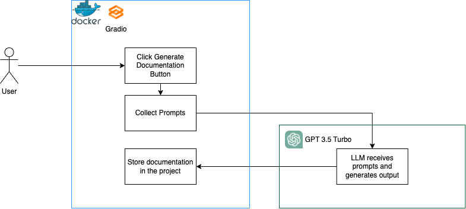
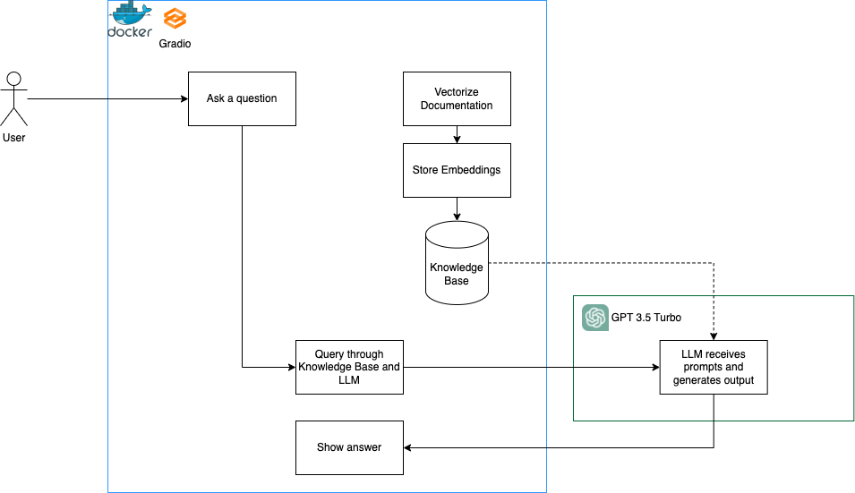
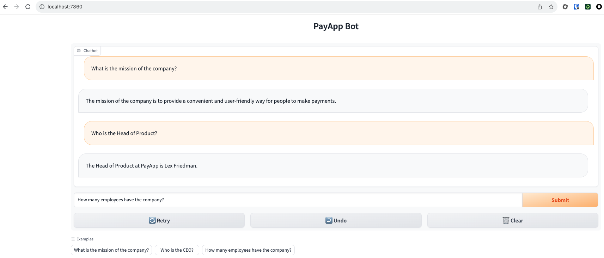

# Doc Company AI 📕🤖

Most of the companies face a challenge to handle their documentation.
Getting all the value from the documentation is an action that sets apart those companies that uses the appropriate tools to retrieve the correct information.

There are some services to store documentation. However, there is not a tool that retrieves the information in a simple and intuitive way.

**Doc Company AI** is an AI-powered application that provides a Chat Bot that reads all the passed documentation and can answer the questions that any user can ask about it.

Simple, but powerful! Doc Company AI can be used can be used by any employee: those who was recently hired, those who want to search an information of a different area, and so on.

This project is developed during the ChatGPT Developers Sprint of [Wizeline Academy](https://academy.wizeline.com/)

## Technology Stack 🛠️

This application is developed with the following tech stack:

- Python (3.10)
- Docker & docker-compose
- OpenAI (1.3.8)
- LangChain (0.0.348)
- LlamaIndex (0.9.3)
- Gradio (4.4.0)

## Configuration ⚙️️

Create a .env file, copying from the env file example:

```
cp .env.example .env
```

Then, fill the OPENAI_API_KEY environment variable in the file.

This project uses Docker. Run the following command to build the project:

```
docker-compose build
```

Run the following command to see the application live:

```
docker-compose up
```

Some seconds after, when the log indicates, search the http://localhost:7860 in the browser:



This UI is built with Gradio, and it is configured in the `main.py` file of the project.

## Application 💻

This application is composed by to stages.

### 1. Text Generation

The application contains a Prompt Engineering module, capable of generating a documentation of a fictional company named **PayApp**.

There are 7 prompts to create the documentation for each department of the company. The prompts give the context of the company, give the information necessary to write and limit the words. **GPT-3.5-turbo model** of ChatGPT is used to generate the documentation.

The documentation is preloaded in the following path: `app/text_generator/documentation/`. However, it can be generated clicking the button located in the lower section of the UI: 



When the message "Information generated successfully" is shown, the new documentation is loaded.

The workflow of this module is the following:



This module is built using **Factory Design Pattern**, in order to switch easily if another LLM is required to use.

This documentation is used in the later stage, which is the Chat Bot.

### 2. Chat Bot & RAG

The application contains a Chat Bot, which answers the question based on the documentation generated in the previous step.

The Chatbot is built over a **RAG pipeline (Retrieval-Augmented Generation)** that uses **LlamaIndex** and **LangChain** frameworks. The documentation is vectorized, generating **embeddings** that are used in every search done.

The workflow of this module is the following:



The following image shows an example of using the Chat Bot:



Thanks for watching the project!